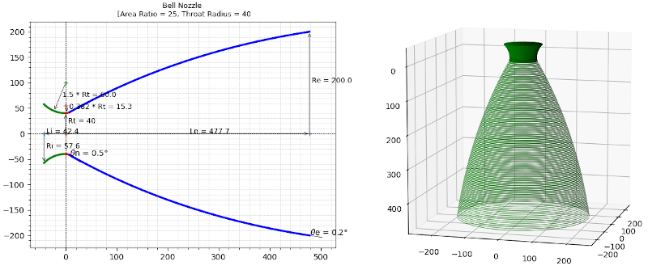
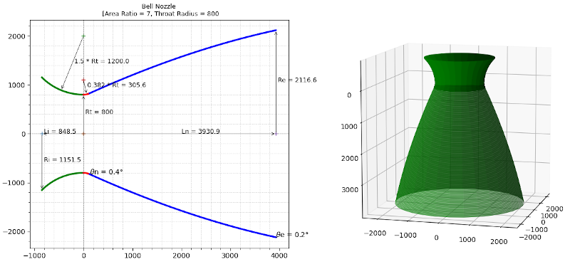

# Plotting a Bell nozzle
> This script plots Bell Nozzle (Thrust Optimised Parabolic (TOP) nozzle)  for the given area-ratio and throat radius.   

##Update   
> Code updated to provide a 3D view in addition to the 2D contour.

## Table of contents
* [General info](#general-info)
* [Screenshots](#screenshots)
* [References](#references)
* [Setup](#setup)
* [How to run](#how)
* [Updates](#updates)
* [To-do list](#to-do)

## Screenshots
Nozzle contours generated by the script.   
&nbsp;        
Upper stage nozzle for e = 25 and Rt = 40    
     

Lower stage nozzle for e = 7 and Rt = 800    
 

## General info
Main parameters required for plotting Rao Nozzle (thrust optimized) contours are section ratio (Exit Area/Throat Area) value and throat radius.    
&nbsp;    
Calculation requires couple of angles which are inferred from wall-angle empirical data. They are θn (throat inflection angle) and θe (exit angle).    

Length of the resulting nozzles are expressed as fractions of the length of a standard 15 degree half-angle conical nozzle.  This parameter is mentioned as the variable 'l_percent = 80' in the code.  This 'length percentage' parameter along with the user defined parameters (section ratio, throat radius) are used to extract θn and θe.    
&nbsp;    
#### Image is from Reference 3. given below

&nbsp;  

Instead of manual extraction of data from the the wall-angle graph, code is written to interpolate graph values of θn and θe for three different length-percentages (60, 80 and 90).      

*Assumption made as mentioned in the reference,*    
'The initial angle isn’t defined and is up to the
combustion chamber designer, -135 degrees is typical.'   
   
&nbsp;   
Plot is displayed with nozzle contour and its  dimensions. *Code is independent of the length unit.  If the throat radius is given in mm, displayed plot values are in mm.  If it is given in inch, plot displayed values will be in inch.*   
&nbsp;   

Implemented the code based on this technical note     
**[The thrust optimised parabolic nozzle]( http://www.aspirespace.org.uk/downloads/Thrust%20optimised%20parabolic%20nozzle.pdf )**     
***    
 
&nbsp;       
The first curve, of radius 1.5 Rt, is drawn from an angle of say, -135 degrees, to the throat at
-90 degrees (angles measured from the arc’s origin).       
&nbsp;      
Then the second curve of radius 0.382 Rt is drawn from this angle of -90 degrees to an angle of (θn - 90) at inflection point N. (Rt is the throat radius, Re is the exit radius.)    
&nbsp;      
Then a skewed parabola is drawn from point N to nozzle exit point E, tangent to the throat
curve, and starting at an angle of θn and ending at an angle of θe.      
&nbsp;      
The radius of the nozzle exit:      
Re = √ε * Rt							[Eqn. 2]     
and nozzle length     
LN = 0.8 ((√∈−1) * Rt )/ tan(15)		[Eqn. 3]     
&nbsp;     
For the throat entrant section:      
x = 1.5 Rt cosθ      
y = 1.5 Rt sinθ + 1.5 Rt + Rt			[Eqn. 4]     
where: −135 ≤ θ ≤ −90      
&nbsp;     
(The initial angle isn’t defined and is up to the
combustion chamber designer, -135 degrees is typical.)     
&nbsp;      
For the throat exit section:     
x = 0.382 Rt cosθ     
y = 0.382 Rt sinθ + 0.382 Rt + Rt		[Eqn. 5]    
where: −90 ≤ θ ≤ (θn − 90)    
&nbsp;     
The bell is a quadratic Bézier curve, which has equations:       
x(t) = (1 − t)^2 * Nx + 2(1 − t)t * Qx + t^2 * Ex, 0≤t≤1     
y(t) = (1 − t)^2 * Ny + 2(1 − t)t * Qy + t^2 * Ey, 0≤t≤1 [Eqn. 6]      
&nbsp;      
Selecting equally spaced divisions between 0 and 1 produces the points described earlier in the graphical method, for example 0.25, 0.5, and 0.75.      
&nbsp;        
Equations 6 are defined by points N, Q, and E (see the graphical method earlier for the locations of these points).    
&nbsp;      
Point N is defined by equations 5 setting the angle to (θn – 90).    
Nx = 0.382 Rt cos(θn – 90)    
Ny = 0.382 Rt sin(θn – 90) + 0.382 Rt + Rt     
&nbsp;   
Coordinate Ex is defined by equation 3, and coordinate Ey is defined by equation 2.   
Ex = 0.8*(((√ε−1)-1)*Rt)/(tan(15)) # degrees in rad    
Ey = √ε * Rt    
&nbsp;   
Point Q is the intersection of the lines:       
NQ = m1 x + C1 and:     
QE = m2 x + C2 			[Eqn. 7]   
&nbsp;     
where: gradient     
m1 = tan(θn ) , m2 = tan(θe )	[Eqn. 8]     
&nbsp;       
and: intercept      
C1 = Ny − m1 Nx      
C2 = Ey − m2 Ex		[Eqn. 9]    
&nbsp;     

The intersection of these two lines (at point Q) is given by:     
Qx = (C2 − C1 ) /(m1 − m2 )      
Qy = (m1 C2 − m2 C1 ) / (m1 − m2 ) [Eqn. 10]     
&nbsp;     

## References
1.  [The thrust optimised parabolic nozzle](    http://www.aspirespace.org.uk/downloads/Thrust%20optimised%20parabolic%20nozzle.pdf )    

2.  [Exhaust Nozzle Contour for Optimum Thrust (Journal of Jet Propulsion 1958.28:377-382) G. V R. Rao ]( https://arc.aiaa.org/doi/10.2514/8.7324 )   
   
2.  [Recent Developments in Rocket Nozzle Configurations (ARS Journal 1961.31:1488-1494 ) G. V R. Rao](http://mae-nas.eng.usu.edu/MAE_6530_Web/New_Course/Section1/RaoRecentDevinRockNozConfig.pdf)   

3. [Liquid Rocket Engine Nozzles-NASA SP-8120](https://ntrs.nasa.gov/search.jsp?R=19770009165)  

***    

## Setup
Script is written with python (Version: 3.6) on linux. Additional modules required :   

* numpy  (tested with Version: 1.18.4 )
* matplotlib  (tested with Version: 2.1.1 )

## How to run   
* Verify and install required modules  
* Modify in main function, the variables  
'aratio = 7.72',   
'throat_radius = 40' and  
'l_percent = 80' (only 60, 80 and 90 data values are built-in)
* run `python bell_nozzle.py` 

## Updates   
* [29Jan2021] - Included a 3D view along with the 2D contour plot

## To-do list

